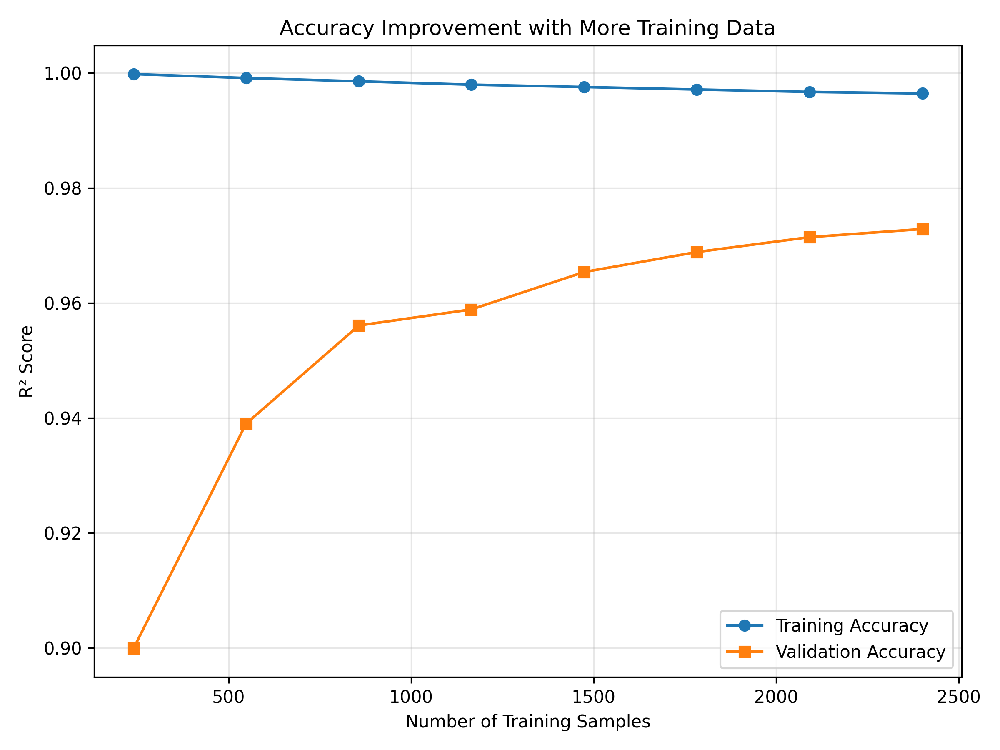
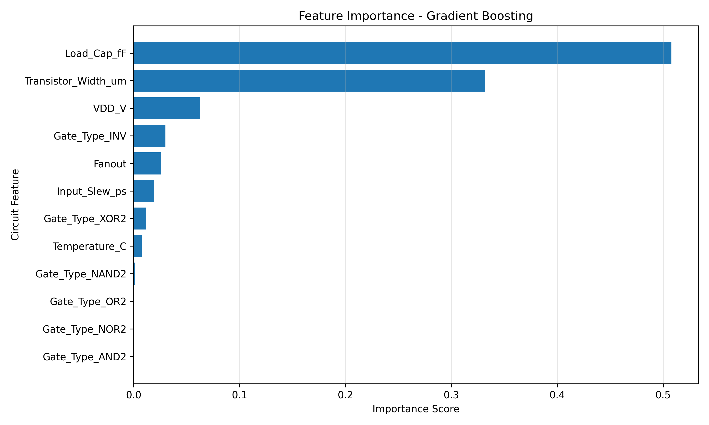

# ML-Based VLSI Timing Prediction

## Overview

Built an ML-based VLSI timing prediction system that predicts CMOS circuit propagation delay using parameters such as gate type, VDD, load capacitance, temperature, fanout, transistor width, and input slew, reducing the need for repeated full circuit simulations.

## Key Features

- CMOS propagation delay prediction using Machine Learning
- Comparison of multiple regression models
- Predicted vs Actual delay visualization
- Accuracy improvement with increasing training data
- Circuit feature importance analysis
- Automated model performance report
- Trained model saved for future predictions

## Technologies Used

Python • NumPy • Pandas • Scikit-learn • Matplotlib • Joblib

## Input Parameters

- Gate Type
- Supply Voltage (VDD)
- Load Capacitance
- Temperature
- Transistor Width
- Fanout
- Input Slew

## Machine Learning Models

The project compares:

- Linear Regression
- Random Forest Regression
- Gradient Boosting Regression

Models are evaluated using:

- MAE
- RMSE
- R² Score

## Outputs

The project generates:

- Predicted vs Actual Delay scatter plot
- Accuracy improvement with training data graph
- Feature importance graph
- Model comparison results
- Timing dataset
- Trained ML model
- Automated performance report

## Results

### Predicted vs Actual Propagation Delay


### Accuracy Improvement with More Training Data



### Feature Importance



## Project Workflow

```text
Circuit Parameters
       ↓
Timing Dataset
       ↓
Data Preprocessing
       ↓
Feature Engineering
       ↓
ML Regression Models
       ↓
Model Evaluation
       ↓
Propagation Delay Prediction
       ↓
Visualization & Analysis


